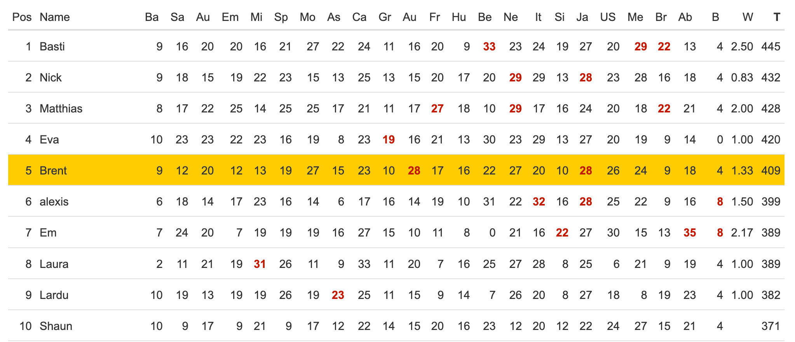
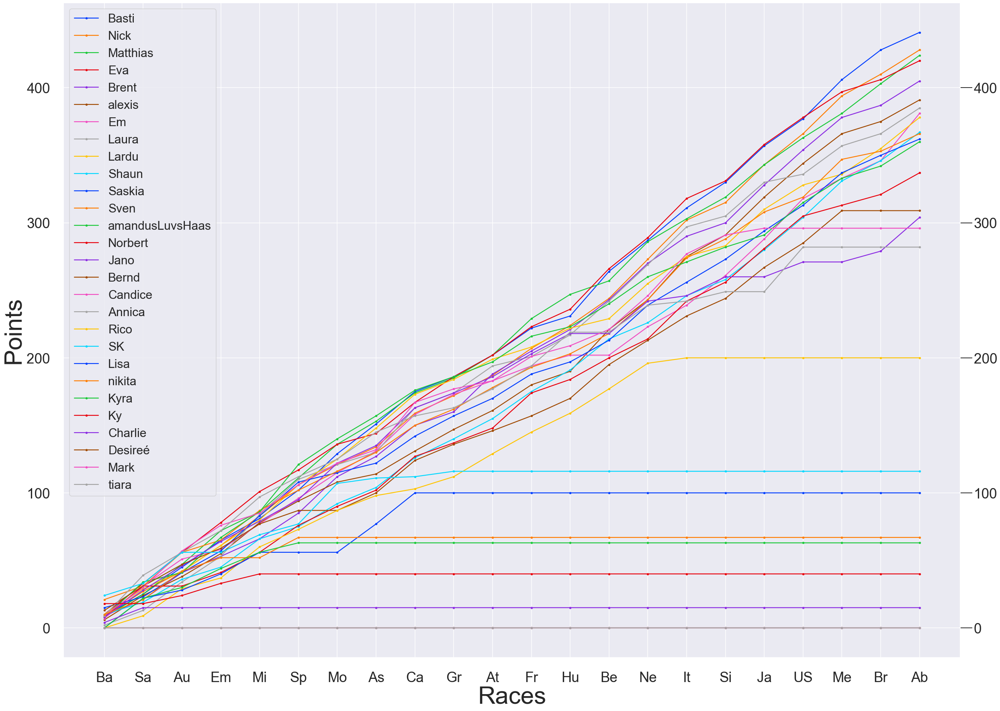
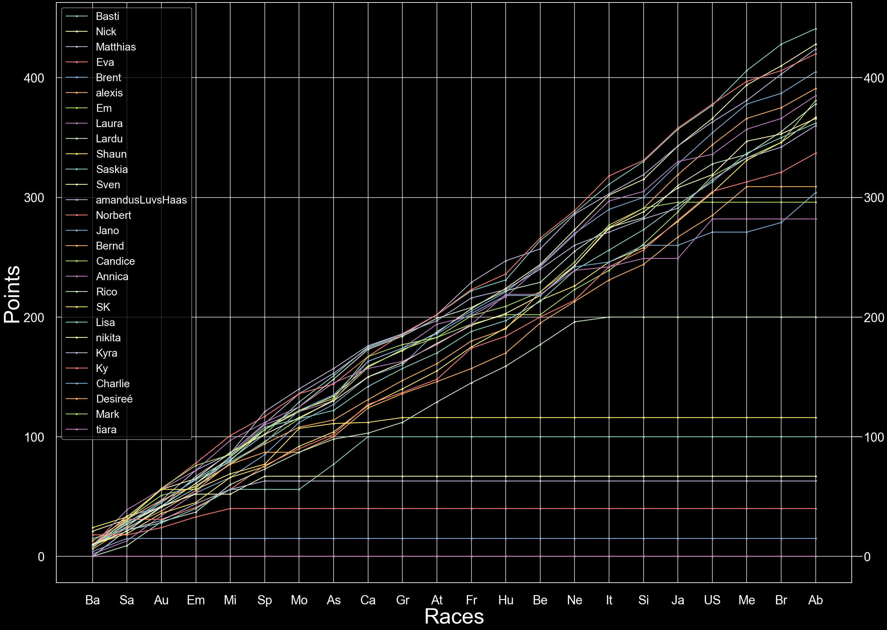
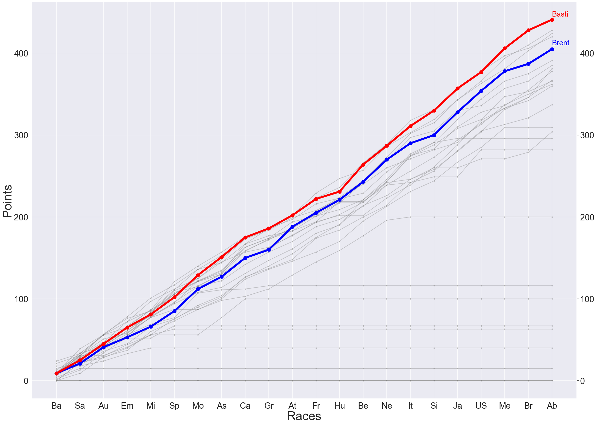
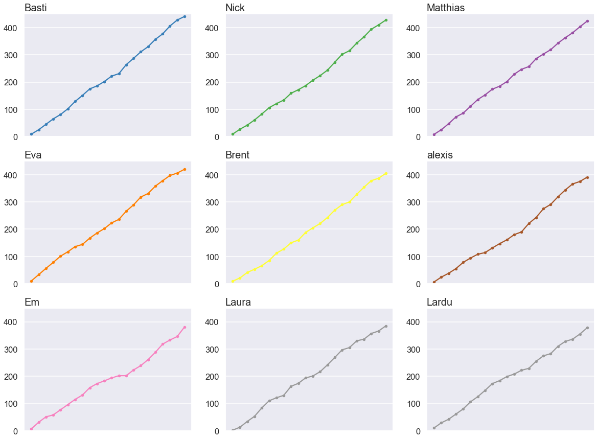
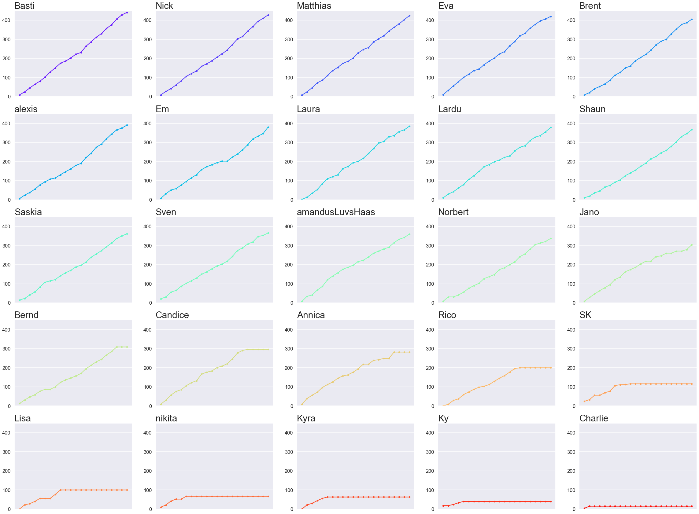

# F1 2022 Fantasy Points Visualization

This project is a visualization of Fantasy Points for the F1 2022 season from a fantasy league I was part of on kicktipp.com. I used Python libraries like Pandas, Matplotlib, Seaborn, BeautifulSoup, and Requests for data scraping, manipulation, and visualization.

## Project Overview

The main purpose of this project was to better understand the performance and scoring pattern of players in our fantasy league. The project offers visualizations like line graphs of all contenders, specific comparisons, and subplots for top players.

## Technology Stack

- **Data Scraping**: BeautifulSoup, Requests
- **Data Manipulation**: Pandas
- **Data Visualization**: Matplotlib.pyplot, Seaborn

## Visualizations

### All Contenders Line Graph (Light Theme)

This visualization gives a glimpse of all contenders' performance over the league.

### All Contenders Line Graph (Dark Theme)

This graph presents the same information as above but in a dark theme for better accessibility and viewing comfort.

### Specific Comparison: My Friend and I

This graph offers a direct comparison between my performance and my friend's performance in the league.

### Top 9 Contenders' Subplots

This series of subplots provides a more detailed view into the top 9 contenders' performance.

### Top 25 Contenders' Subplots

This series of subplots goes even further, detailing the performance of the top 25 contenders.

